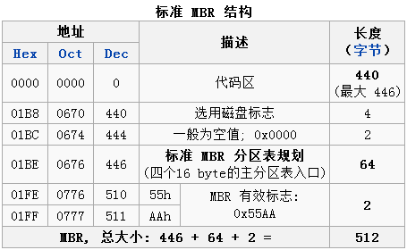
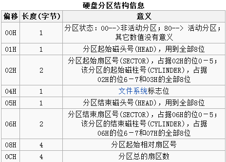

硬盘的0柱面、0磁头、1扇区称为主引导扇区，FDISK程序写到该扇区的内容称为主引导记录（MBR）。该记录占用512个字节，它用于硬盘启动时将系统控制权交给用户指定的，并在分区表中登记了的某个操作系统区。

## 1.MBR的读取
硬盘的引导记录（MBR）是不属于任何一个操作系统，也不能用操作系统提供的磁盘操作命令来读取它。但我们可以用ROM-BIOS中提供的INT13H的2号功能来读出该扇区的内容，也可用软件工具Norton8.0中的DISKEDIT.EXE来读取。

用INT13H的读磁盘扇区功能的调用参数如下：

- 入口参数：AH=2 （指定功能号）
- AL=要读取的扇区数
- DL=磁盘号（0、1-软盘；80、81-硬盘）
- DH=磁头号
- CL高2位+CH=柱面号
- CL低6位=扇区号
- CS:BX=存放读取数据的内存缓冲地址
- 出口参数：CS:BX=读取数据存放地址
- 错误信息：如果出错CF=1 AH=错误代码

用DEBUG读取位于硬盘0柱面、0磁头、1扇区的操作如下：
```text
A>DEBUG
-A 100
XXXX:XXXX MOV AX,0201 （用功能号2读1个扇区）
XXXX:XXXX MOV BX,1000 （把读出的数据放入缓冲区的地址为CS:1000）
XXXX:XXXX MOV CX,0001 （读0柱面，1扇区）
XXXX:XXXX MOV DX,0080 （指定第一物理盘的0磁头）
XXXX:XXXX INT 13
XXXX:XXXX INT 3
XXXX:XXXX （按回车键）
-G=100 （执行以上程序段）
-D 1000 11FF （显示512字节的MBR内容）
```

## 2.MBR的组成
一个扇区的硬盘主引导记录MBR由4个部分组成, 446 + 64 + 2 = 512。

- 主引导程序（偏移地址0000H--0088H），它负责从活动分区中装载，并运行系统引导程序。
- 出错信息数据区，偏移地址0089H--00E1H为出错信息，00E2H--01BDH全为0字节。
- 分区表（DPT,Disk Partition Table）含4个分区项，偏移地址01BEH--01FDH,每个分区表项长16个字节，共64字节为分区项1、分区项2、分区项3、分区项4。
- 结束标志字，偏移地址01FE--01FF的2个字节值为结束标志55AA,如果该标志错误系统就不能启动。


> 主引导记录扇区记录着磁盘本身的相关信息以及磁盘各个分区的大小及位置信息，是数据信息的重要入口。如果它受到破坏，硬盘上的基本数据结构信息将会丢失，难以恢复。主引导扇区内的信息可以通过任何一种基于某种操作系统分区工具软件写入，但是和某种操作系统没有特定的关系，即只要创建了有效的主引导记录就可以引导任意一种操作系统（操作系统是创建在高级格式化的硬盘分区上，是和一定的文件系统相联系的）。

主引导分区最开头是第一阶段引导代码。其中的硬盘引导程序的主要作用是检查分区表是否正确并且在系统硬件完成加电自检以后将控制权交给硬盘上的引导程序（如GNU GRUB）。它不依赖任何操作系统，而且启动代码也是可以改变的，从而实现多系统引导。

## 3.MBR中的分区信息结构
占用512个字节的MBR中，偏移地址01BEH--01FDH的64个字节，为4个分区项内容（分区信息表）。它是由磁盘介质类型及用户在使用 FDISK定义分区时确定的。在实际应用中，FDISK对一个磁盘划分的主分区可少于4个，但最多不超过4个。每个分区表的项目是16个字节，其内容含义如下表所示。

|  存贮字节位   | 内容及含义  |
|  ----  | ----  |
| 第1字节  | 引导标志。若值为80H表示活动分区，若值为00H表示非活动分区。 |
| 第2、3、4字节 | 本分区的起始磁头号、扇区号、柱面号。其中：磁头号——第2字节；扇区号——第3字节的低6位；柱面号——为第3字节高2位+第4字节8位。 |
|第5字节|分区类型符。00H——表示该分区未用（即没有指定）；06H——FAT16基本分区；0BH——FAT32基本分区；05H——扩展分区；07H——NTFS分区；0FH——（LBA模式）扩展分区（83H为Linux分区等）。|
|第6、7、8字节|本分区的结束磁头号、扇区号、柱面号。其中：磁头号——第6字节；扇区号——第7字节的低6位；柱面号——第7字节的高2位+第8字节。|
|第9、10、11、12字节|本分区已用的扇区数。|
|第13、14、15、16字节|本分区的总扇区数。|



## 4.MBR的主要功能及工作流程
在CPU上电之后，若由硬盘启动，则BIOS将硬盘的主引导记录（位于0柱面、0磁道、1扇区）读入7C00处，然后将控制权交给主引导代码。主引导代码的任务包括：

- 扫描分区表，找到一个激活(可引导)分区；
- 找到激活分区的起始扇区；
- 将激活分区的引导扇区装载到内存7C00处；
- 将控制权交给引导扇区代码；

如果主引导代码无法完成上述任务，它将显示以下错误信息之一：
- No active partition.
- Invalid partition table.
- Error loading operating system.
- Missing operating system.

> 机器加电或按reset键后都要进行系统复位，复位后CS=FFFFH，IP=0000H，那么自然就从FFFF:0000H处开始执行指令，这个地方只有一条JMP指令跳转到系统自检程序处，系统自检完成后把软盘的第一个扇区（如果由软盘启动）或者硬盘的第一个扇区，即MBR扇区（如果由硬盘启动）读入到0:7C00H处，然后把控制权交出，从0:7C00H处继续执行。

下面就是硬盘的MBR代码分析：

其中的引导扇区是指硬盘相应分区的第一个扇区，是和操作系统有关的。操作系统的引导是由它来完成的，而MBR并不负责，MBR和操作系统无关。引导扇区的任务是把控制权转交给操作系统的引导程序。

程序流程：
1. 将程序代码由0:7C00H移动到0:0600H（注，BIOS把MBR放在0:7C00H处）
2. 搜索可引导分区，即80H标志
    - 成功：goto 3 
    - 失败：跳入ROM BASIC
    - 无效分区表：goto 5
3. 读引导扇区
    - 成功：goto 4
    - 失败：goto 5
4. 验证引导扇区最后是否为55AAH
    - 成功：goto 6
    - 失败：goto 5
5. 打印错误进入无穷循环
6. 跳到0:7C00H进行下一步启动工作

## 5、硬盘逻辑驱动器的分区表链结构
硬盘是由很多个512字节的扇区组成，而这些扇区会被组织成一个个的“分区”。

硬盘的分区规则是：一个分区的所有扇区必须连续，硬盘可以有最多4个物理上的分区，这4个物理分区可以时个主分区或者3个主分区加一个扩展分区。在DOS/Windows管理下的扩展分区里，可以而且必须再继续划分逻辑分区（逻辑盘）。

扩展分区的信息位于硬盘分区表（DPT）中, 而逻辑驱动器的信息则位于扩展分区的起始扇区, 即该分区的起始地址（面/扇区/磁道）所对应的扇区, 该扇区中的信息与硬盘主引导扇区的区别是不包含MBR, 而16字节的分区信息则表示的是逻辑驱动器的起始和结束地址等。

MBR( Master Boot Record )主引导记录包含两部分的内容，前446字节为启动代码及数据，而从446(0x1BE)开始则是分区表，分区表由四个分区项组成，每个分区项数据为16字节，记录了启动时需要的分区参数。


